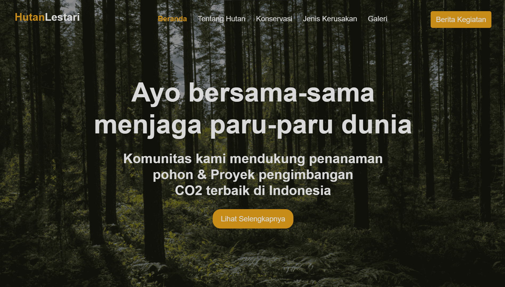

# Desain Web Life On Land

Desain Web Life On Land adalah sebuah proyek yang bertujuan untuk meningkatkan kesadaran tentang kerusakan dan degradasi hutan di Indonesia. Proyek ini menyoroti pentingnya hutan bagi kehidupan manusia dan ekosistem serta bertujuan untuk memberikan edukasi kepada pengunjung mengenai berbagai jenis kerusakan hutan. Proyek ini fokus pada Goal 15 (Kehidupan di Darat) dari Tujuan Pembangunan Berkelanjutan Perserikatan Bangsa-Bangsa.

## Fitur

- Navigasi: Menu navigasi yang mudah digunakan memungkinkan pengunjung untuk menjelajahi berbagai bagian dari situs web dengan mudah.
- Jenis Kerusakan Hutan: Menyediakan informasi tentang berbagai jenis kerusakan hutan, seperti kebakaran hutan, pembabatan hutan, hingga penggunaan lahan.
- Berita Kerusakan Hutan: Menampilkan artikel berita dan pembaruan terkait kerusakan hutan, membantu pengunjung tetap terinformasi tentang isu-isu terkini.
- Galeri Foto: Memperlihatkan keindahan hutan dan konsekuensi dari kerusakan hutan.
- Desain Responsif: Situs web ini dioptimalkan untuk memberikan pengalaman yang lancar di berbagai perangkat, termasuk layar HD dan Full HD.

## Library/Framework yang Digunakan

- Animate On Scroll (AOS): Library untuk memberikan efek animasi pada elemen saat melakukan scroll, meningkatkan daya tarik visual situs web.
- Bootstrap: Frameworok CSS populer yang menyediakan sistem grid responsif dan komponen siap pakai untuk pengembangan web yang efisien.
- CounterUp: Library JavaScript ringan untuk memberikan animasi pada nilai numerik, berguna untuk menampilkan statistik atau angka penting.
- jQuery: Library JavaScript yang cepat dalam menyederhanakan traversing dokumen HTML, penanganan event, dan animasi.
- Waypoints: library yang berfungsi saat melakukan scroll ke elemen tertentu, memungkinkan interaksi dan animasi yang dinamis 

## Penggunaan

Untuk menggunakan atau berkontribusi pada proyek Desain Web Life On Land, ikuti langkah-langkah berikut:

1. Membuka dan Mengekstrak File zip
2. Buka file index.html di peramban web pilihan Anda.
3. Jelajahi situs web dan fitur-fiturnya.
4. Jika Anda ingin melakukan perubahan atau berkontribusi pada proyek ini, buka file-file tersebut di editor teks atau IDE favorit Anda.

## Lisensi

Proyek Desain Web Life On Land dirilis di bawah [Lisensi IT Club](LICENSE). Anda bebas menggunakan, mengubah, dan mendistribusikan kode sesuai dengan ketentuan lisensi.

## Terima Kasih

Kami ingin berterima kasih kepada sumber daya berikut pada proyek ini:

- [Animate On Scroll (AOS)](https://michalsnik.github.io/aos/) - Dokumentasi Resmi
- [Bootstrap](https://getbootstrap.com/) - Situs Web dan Dokumentasi Resmi
- [CounterUp](https://github.com/bfintal/Counter-Up) - Repositori GitHub
- [jQuery](https://jquery.com/) - Situs Web dan Dokumentasi Resmi
- [Waypoints](https://imakewebthings.com/waypoints/) - Situs Web dan Dokumentasi Resmi

## Kontak

Untuk pertanyaan, saran, atau umpan balik, jangan ragu untuk menghubungi kami di [email protected]

Mari kita melindungi dan melestarikan hutan kita untuk masa depan yang berkelanjutan!
